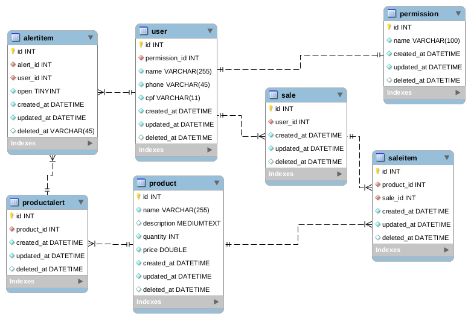

## Sistema de Gestão Comercial

&nbsp;
### Descriação do sistema:

 
O sistema de gestão comercial é um software cujo objetivo é auxiliar o comerciante a obter controle sobre todos os departamentos de seu empreendimento.
 
O primeiro requisito do sistema  é o controle de estoque de produtos, onde o usuário cadastra o produto e a quantidade, e o sistema monitora a saída desses produtos, emitindo um alerta quando o estoque estiver abaixo de um volume que o usuário especificar.
 
Um segundo requisito, o sistema deverá possuir um módulo de controle de acesso para cada usuário fazendo com que ele só consiga acessar os recursos de acordo com o seu nível de permissão.
 
Por último, ele deve possuir um módulo de caixa, para realizar a venda de um produto, além de contar também com relatórios de vendas.

&nbsp;
### Modelo de dados:

